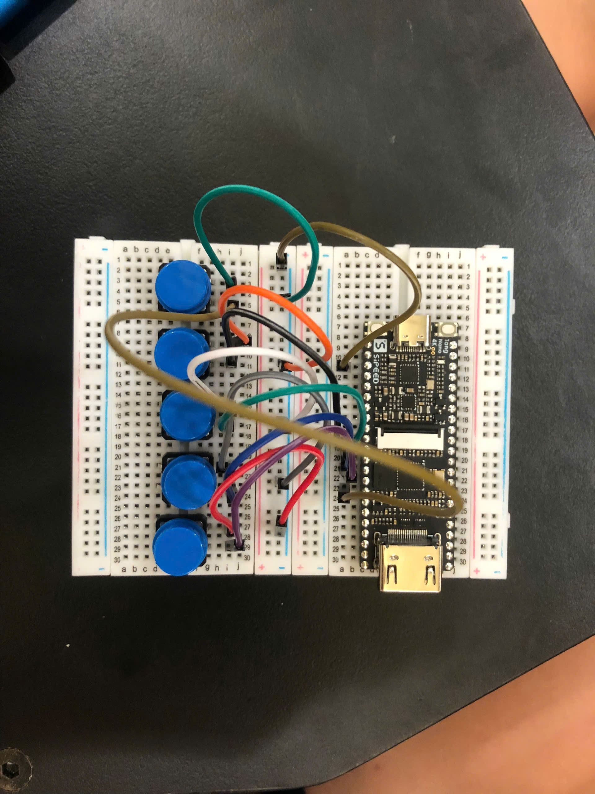
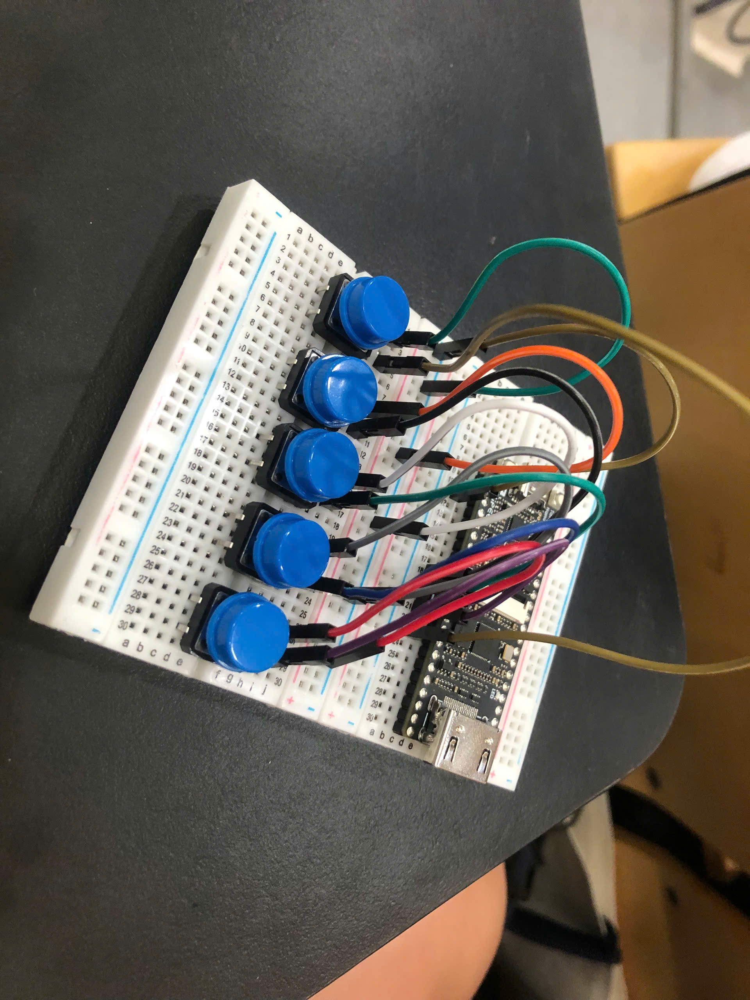
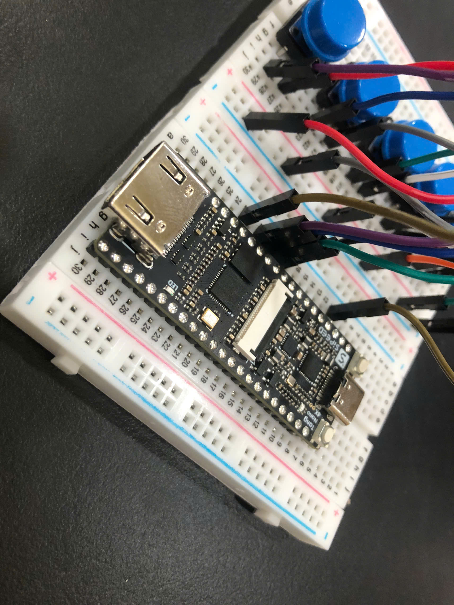

# Zombie Survival on a Tang Nano 4K

A side-view survival shooter written in Verilog, running on a Sipeed Tang Nano 4K
(Gowin GW1NSR-4C) and drawn over HDMI at 640x480.

Built by **Team 7A** at the **TSIC x Synopsys summer camp**, where it took
**3rd prize** in the closing hackathon.

You are a survivor defending a bunker. Zombies walk in from the right and you
shoot them automatically. If any zombie reaches the bunker or touches you, the
run ends. **How long you survive is your score.**

## Playing

Five buttons. WASD moves you around, the fifth one fires your skill, and the
board's own reset button restarts after a game over. Wiring is in
[The hardware](#the-hardware) below.

Shooting is automatic. There is no fire button, and the survivor always faces
right. The game waits on a title screen until you press anything.

Kill 20 zombies and the counter in the top right turns green, which means the
skill is charged. Pressing the skill button spends the streak and triples your
fire rate for 10 seconds. The skill is the intended answer to a mini boss.

## The enemies

| Enemy | Size | Speed | Bullets to kill | Shows up |
|---|---|---|---|---|
| normal | 32x32 | 2 px/frame | 1 | always |
| fast (red tint) | 32x32 | 3 px/frame | 1 | level 2+ |
| tanky (blue tint) | 32x32 | 1 px/frame | 3 | level 3+ |
| mini boss | 96x96 | 0.5 px/frame | 13 | 40 s+ |

Difficulty goes up one level every 10 seconds and stops at level 7 (60 s), where
zombies arrive twice a second. The mini boss stays rare, at roughly 3% of spawns,
rising to 8% at 100 seconds and 12% at 120 seconds. Only one can be alive at a
time, because it has a reserved slot in the zombie array.

## The hardware



Everything runs off one Tang Nano 4K. The board handles video by itself, so the
only thing to build is the controller, which is five buttons on a breadboard.

| Button | Tang Nano pin | Does |
|---|---|---|
| W | 16 | move up |
| A | 20 | move left |
| S | 13 | move down |
| D | 17 | move right |
| skill | 18 | fast shooting for 10 seconds |

Wiring each button is as simple as it looks. One leg goes to its pin, the other
leg goes to the ground rail, and that is the whole circuit.

There are **no resistors anywhere on this board**, which surprises people. The
FPGA has pull-up resistors built into its pins, and `src/hdmi_coin.cst` switches
them on with `PULL_MODE=UP`. So a pin sits high on its own and only reads low
while you are holding the button down. That is why `debounce.v` inverts its input
and treats low as pressed.



One thing to be careful about: those five pins live in a 1.8 V bank. Shorting
them to ground is exactly what they are for, but do not wire them to 3.3 V or to
anything that drives a voltage into them.

Restarting after a game over uses the Tang Nano's own reset button, which is
already on the board. There is nothing to wire for it.



Plug HDMI into a monitor and USB-C into your computer. The USB-C carries both
power and the bitstream, so no separate supply is needed.

<!-- TODO: add a photo of the game running on a screen, e.g. images/gameplay.jpg -->

## What you need to install

Only one of these is actually required to get the game onto a board. The rest
just make the code nicer to work on.

### Required

**Gowin EDA, Education edition.** This is the tool that turns the Verilog into a
bitstream and uploads it. Download it from
[Gowin's developer site](https://www.gowinsemi.com/en/support/home/). We used
`Gowin_V1.9.11.03_Education_x64` and it worked straight after installing, with no
licence file to request. Any recent version should be fine.

The build script looks for it at `C:\Gowin\Gowin_V1.9.11.03_Education_x64`. If
yours is somewhere else, point `GOWIN_HOME` at your install once and every task
picks it up:

```powershell
setx GOWIN_HOME "C:\Gowin\YourGowinFolder"
```

**Windows.** The build and asset scripts are PowerShell, and `png2mem` uses
.NET's `System.Drawing` to read the PNGs, so it needs Windows PowerShell rather
than a POSIX shell. Everything else in the project is plain Verilog and would
port fine, but nobody has tried.

That is the whole list. If you only want to build and play, stop here.

### Recommended for editing the code

**VS Code**, plus the **Verilog-HDL/SystemVerilog** extension
(`mshr-h.veriloghdl`). Open the project and VS Code offers it automatically,
because it is listed in `.vscode/extensions.json`. It gives you syntax
highlighting and drives the linter below.

**Icarus Verilog**, which is what actually finds your errors. The extension only
calls it, so without this installed you get colours and nothing else. Grab a
Windows build from [bleyer.org/icarus](https://bleyer.org/icarus/) and make sure
`iverilog` ends up on your PATH.

`.vscode/settings.json` already knows where this project's headers and modules
live, so include paths and cross-module references resolve once `iverilog` is
present. Catching a typo as a squiggle instead of five minutes into a synthesis
run is worth the install.

Note that Icarus only checks that the Verilog is valid. Whether it fits on the
chip is a question only Gowin can answer.

## Building

Open the folder in VS Code and use the tasks (Ctrl+Shift+P, Run Task):

- **run** synthesises, places and routes, then uploads to the board
- **png2mem** and **bitmap2mem** rebuild the assets
- **monitor** opens the camera to watch the HDMI output
- **zip** packages the project for hand-in

Watch the resource table Gowin prints at the end of each build. The design sits
close to full, at roughly 84% logic, 92% CLS and 9 of 10 BSRAM, so if a change
stops fitting, lower `MAX_ZOMBIE` or `MAX_BULLET` in `src/game/game_core.v`
before touching anything else.

If the upload dies instantly with exit code 50, that is the USB connection rather
than your code. Unplug the board, plug it back in, and run **run** again.

## How the pixels get out

```text
top
  -> reset_sync, ff_sync, debounce      clean up the buttons
  -> game_core
       -> game_ctrl                     all the game rules
       -> bg_layer                      map and bunker
       -> obj_layer                     zombies, bullets, player
       -> ui_layer                      timer, LEVEL, kill streak
       -> res_overlay                   game over panel
  -> svo_hdmi -> svo_enc -> svo_tmds -> HDMI
```

Each layer takes the stream of pixels in and passes it out with its own drawing
painted on top, so layers further down the list win. Any layer that reads a ROM
also delays the stream by one clock, because the ROM's output is registered.

`tuser[0]` marks the first pixel of a frame, and `game_ctrl` uses it as its only
clock. One game step per frame, 60 steps a second.

## Where to change things

| To change | Edit |
|---|---|
| screen layout, sprite sizes, ground line, bunker | `src/game/game_defs.vh` |
| game rules such as speeds, spawn rates, difficulty and the skill | `src/game/game_ctrl.v` |
| how many zombies and bullets can exist at once | `src/game/game_core.v` |
| button pins | `src/hdmi_coin.cst` |
| the map colours and the bunker | `src/overlay/bg_layer.v` |
| timer, LEVEL and streak display | `src/overlay/ui_layer.v` |

## Assets

Art lives in `png/` and the letters in `bitmap/`. The FPGA reads neither of them
directly. Both are converted into `.mem` files in `src/assets/`, which get built
into the bitstream's block RAM.

- **png2mem** turns `png/*.png` into `src/assets/*.mem`. The zombie and the boss
  are packed into one `obj_atlas.mem` so they cost one block of RAM instead of
  two. Block RAM is the scarcest thing on this chip, at 9 of 10 blocks used.
- **bitmap2mem** turns the hand-drawn 6x12 letters in `bitmap/*.txt` into
  `res_font.mem`. Glyph order is **append-only**, because `ui_layer` and
  `res_overlay` hard-code the index of each letter. Reordering `bitmap/` breaks
  every piece of text on screen.

Re-run the matching task after editing any art.

## The team

Team 7A, TSIC x Synopsys summer camp:

- **Huy Hoang Le** (team leader)
- **Lucas Chang**
- **Alison Chen**
- **Amber Lin**
- **Raphaelt Seng**

## Credits

Huge thanks to **Bryant Chen**, our mentor at TSIC, who wrote
the `hdmi_coin` coin-catcher demo this project grew out of. That demo gave us a
working HDMI pipeline and a project skeleton on day one, which is the only reason
five people with no FPGA experience could spend the camp writing a game instead
of fighting TMDS timing. The original is at
[czl0706/tsic-proj2-coin](https://github.com/czl0706/tsic-proj2-coin).

We rebuilt the game on top of it. The rules, the drawing layers, the sprites and
the tooling in `src/game/`, `src/overlay/`, `src/common/`, `png/`, `bitmap/` and
`.vscode/` are ours.

Two parts are not, and are used as they came:

- `src/hdmi/` is the [SVO](https://github.com/cliffordwolf/svo) Simple Video Out
  core by Clifford Wolf, under the ISC licence. See `LICENSE`.
- `src/ip/` holds PLL and clock-divider blocks generated by the Gowin IDE.
