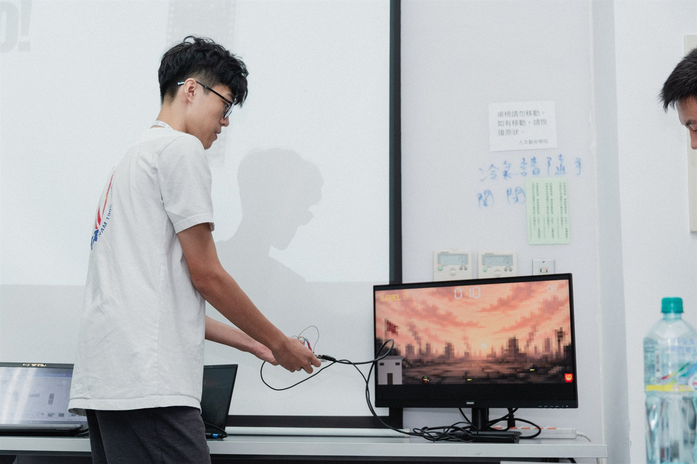
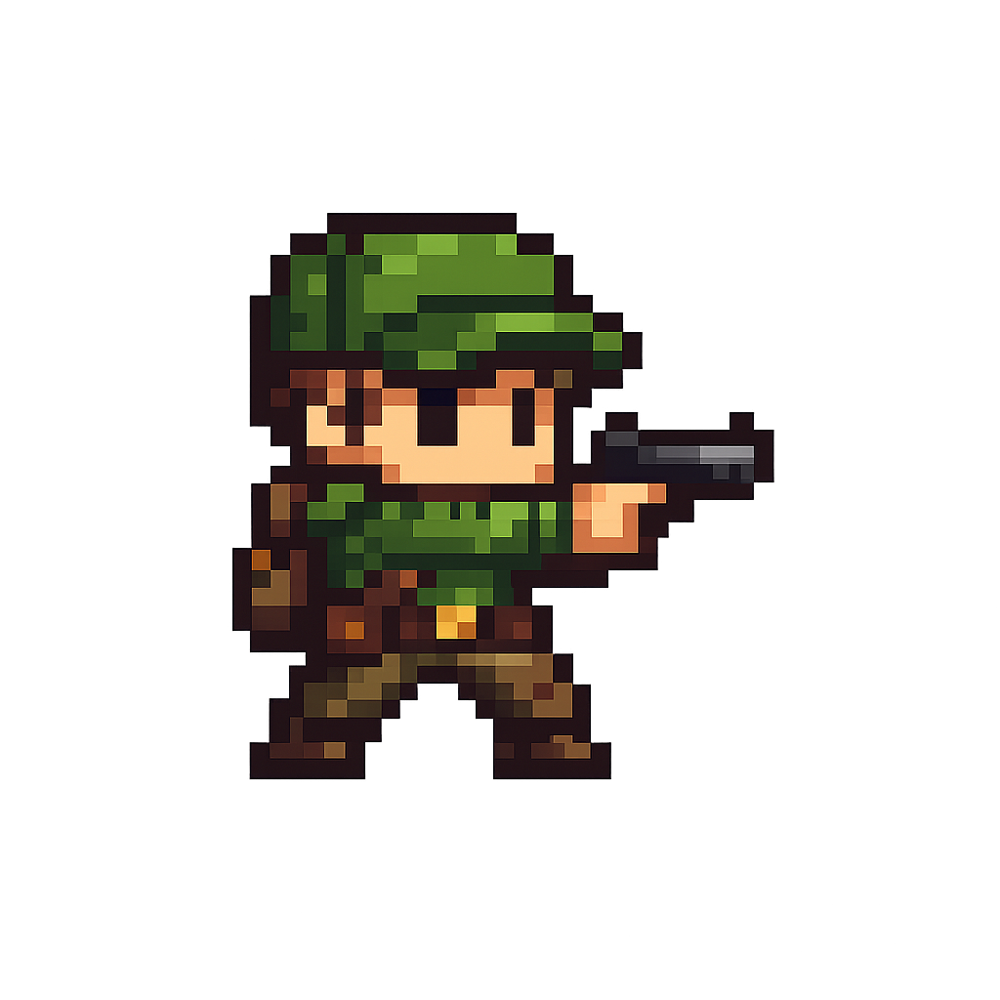
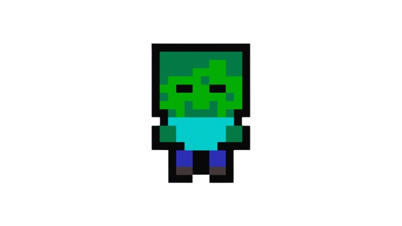
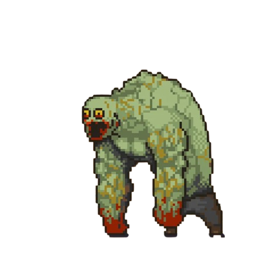
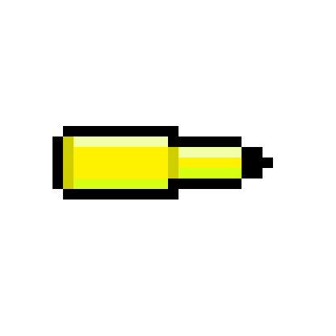
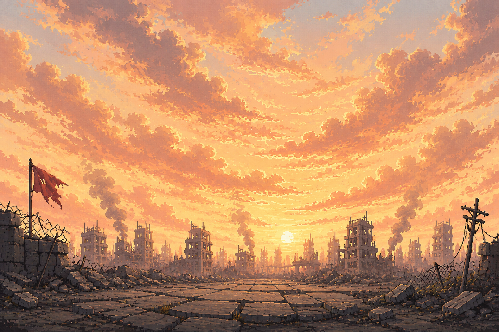
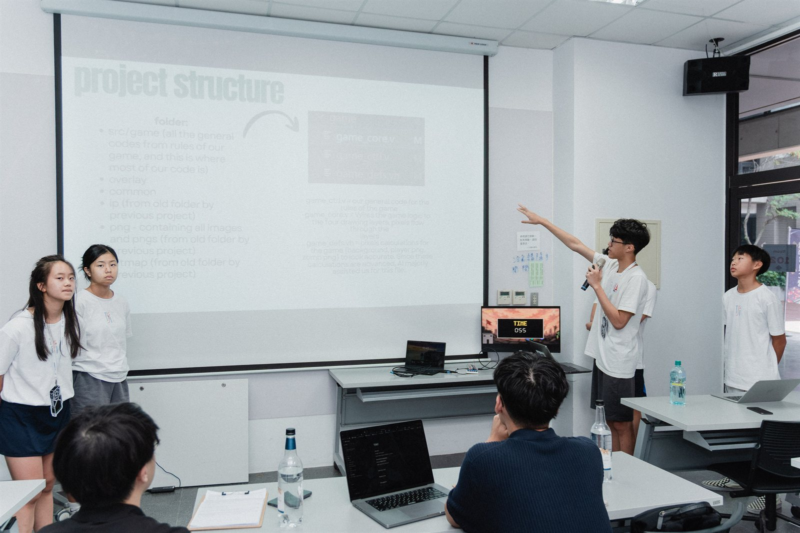
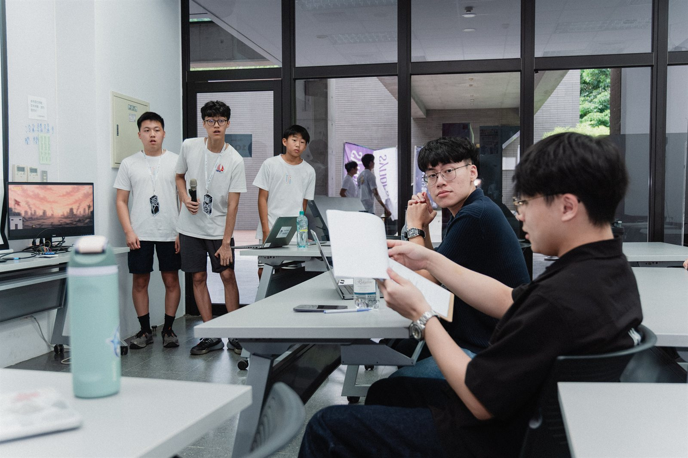
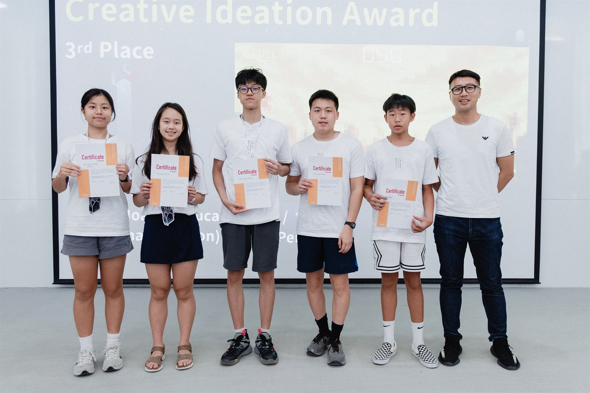

# Zombie Survival on a Tang Nano 4K

This is a side-view survival shooter written in Verilog, running on a Sipeed Tang Nano 4K
(Gowin GW1NSR-4C) and drawn straight out to HDMI at 640x480.

We built this as Team 7A during the 4 days TSIC x Synopsys summer camp's hackathon, and it ended up
taking 3rd prize in the Creative Ideation Award.



You play a survivor defending a bunker on the left of the screen, and zombies
keep walking in from the right to get at it. You shoot at them constantly without
having to press anything, so the game is really about moving well and knowing
when to spend your skill. A run ends the moment a zombie touches you or slips
past you to the bunker, which means how long you last is the only score there is.

That photo is the whole thing actually working. The board is in the hand on the
left, the breadboard controller is plugged into it, and everything on the screen
is being generated live by the FPGA. You can see the level counter on the left,
the survival timer in the middle, and the kill streak over on the right.

## Playing

In this game (or as you can see on the breadboard prototype), there are five buttons altogether. For the first 4 buttons, from left to right, equals to moving left, up, down, and right, and the fifth
one (the rightmost one) fires your skill (which just shoots faster to clear more zombies). When you die, you will press the "RESET" button on the Tang Nano board to basically start the game over.

We decided fairly early that there wouldn't be a fire button at all, because the
survivor shoots on his own the whole time and always faces right. Nothing starts
moving until you press something, so the title screen just sits there waiting for
you to be ready.

Once you have killed 20 zombies the counter in the top right corner turns green,
which is how you know your skill has charged. Pressing the skill button makes you
fire three times as fast for ten seconds and drops the streak back to zero, and
it is worth holding onto for the mini boss, because that is really what we added
it for in the first place.

## The enemies

| Enemy | Size | Speed | Bullets to kill | Shows up |
|---|---|---|---|---|
| normal | 32x32 | 2 px/frame | 1 | always |
| fast (red tint) | 32x32 | 3 px/frame | 1 | level 2+ |
| tanky (blue tint) | 32x32 | 1 px/frame | 3 | level 3+ |
| mini boss | 96x96 | 0.5 px/frame | 13 | 40 s+ |

The difficulty steps up every 10 seconds and tops out at level 7 after a minute,
by which point zombies are arriving twice a second and you are mostly just trying
to keep away from them. We kept the mini boss deliberately rare, at around 3% of
spawns to begin with, climbing to 8% once you pass 100 seconds and 12% past 120,
and only one of them can ever be alive at a time because it gets its own reserved
slot in the zombie array.

## The art

Everything you see on screen started as one of the five files in `png/`, and the
build converts them down into the tiny formats the FPGA can actually hold.

<table>
<tr>
<td align="center"><br><sub><b>survivor.png</b><br>you, drawn at 32x32</sub></td>
<td align="center"><br><sub><b>zombie.png</b><br>all three walkers, 32x32</sub></td>
<td align="center"><br><sub><b>boss.png</b><br>stored 24x24, drawn 96x96</sub></td>
<td align="center"><br><sub><b>bullet.png</b><br>16x16</sub></td>
</tr>
</table>

<br>
<sub><b>daylight.png</b>, the ruined city behind everything, squeezed all the way
down to an 80x50 tile and then drawn back out at 8x.</sub>

The normal, fast and tanky zombies are all the same picture, and `obj_layer`
tints it towards red or blue on the fly so you can tell at a glance what is
coming at you. That saved us two more sprites we had no room for.

## The hardware


Everything runs off the one board. The Tang Nano handles the video by itself, so
the only thing we actually had to build was a controller, and that turned out to
be five buttons on a breadboard.

| Button | Tang Nano pin | Does |
|---|---|---|
| W | 16 | move up |
| A | 20 | move left |
| S | 13 | move down |
| D | 17 | move right |
| skill | 18 | fast shooting for 10 seconds |

Each button has one leg going to its pin and the other going to the ground rail,
and that is genuinely the whole circuit.

You might notice there is not a single resistor anywhere on that breadboard, and
that is because the FPGA already has pull-up resistors built into its pins.
`src/hdmi_coin.cst` switches them on with `PULL_MODE=UP`, so every pin sits high
by itself and only reads low while you are actually holding a button down. That
is also the reason `debounce.v` inverts its input and treats low as pressed,
which looks completely backwards until you know why it is there.


The one thing worth being careful about is that those five pins sit in a 1.8 V
bank. Shorting them to ground is exactly what they are for, but you should not
wire them to 3.3 V or to anything else that drives a voltage into them.


HDMI goes to a monitor and USB-C goes to your computer, and since the USB-C
carries the power and the bitstream both, there is nothing else to plug in.


## What you need to install

Only the first of these is genuinely required, and the rest are there to make the
code nicer to work on.

### Required

**Gowin EDA, Education edition** is what turns the Verilog into a bitstream and
pushes it onto the board, and you can download it from
[Gowin's developer site](https://www.gowinsemi.com/en/support/home/). We were
running `Gowin_V1.9.11.03_Education_x64` and it worked straight out of the
installer without any licence to request, so any reasonably recent version should
be fine.

The build script expects to find it at `C:\Gowin\Gowin_V1.9.11.03_Education_x64`,
but if yours lives somewhere else you can set `GOWIN_HOME` once and every task
will pick it up from there instead:

```powershell
setx GOWIN_HOME "C:\Gowin\YourGowinFolder"
```

**Windows** is the other requirement, because the build and asset scripts are all
PowerShell and `png2mem` leans on .NET's `System.Drawing` to read the PNGs, so it
wants Windows PowerShell rather than a POSIX shell. The Verilog itself would port
across without much trouble, but none of us has tried it.

If all you want is to build the thing and play it, that is everything you need.

### Recommended for editing the code

**VS Code** with the **Verilog-HDL/SystemVerilog** extension
(`mshr-h.veriloghdl`) is what we all used, and VS Code will offer you the
extension as soon as you open the folder because it is listed in
`.vscode/extensions.json`. It gives you syntax highlighting and it drives the
linter below.

**Icarus Verilog** is the part that actually catches your mistakes, since the
extension on its own only calls out to it. If you install the extension and skip
this, all you get is nice colours and no error checking, which is a frustrating
way to lose an afternoon. Windows builds are at
[bleyer.org/icarus](https://bleyer.org/icarus/), and `iverilog` needs to end up on
your PATH for the extension to find it.

We already set up `.vscode/settings.json` with the include paths and module
directories this project uses, so everything resolves properly the moment
`iverilog` exists, and catching a typo as a red squiggle is a great deal quicker
than catching it five minutes into a synthesis run. Bear in mind that Icarus only
tells you the Verilog is valid, and whether it actually fits on the chip is a
question only Gowin can answer.

## Building

Open the folder in VS Code and run the tasks with Ctrl+Shift+P, Run Task:

- **run** synthesises, places, routes, and uploads to the board
- **png2mem** and **bitmap2mem** rebuild the assets
- **monitor** opens the camera app so you can watch the HDMI output
- **zip** packages the project up for hand-in

It is worth keeping an eye on the resource table Gowin prints at the end of every
build, because we are close to full at roughly 84% logic, 92% CLS and 9 of 10
BSRAM. If a change suddenly stops fitting, the first thing to try is lowering
`MAX_ZOMBIE` or `MAX_BULLET` in `src/game/game_core.v` before you start rewriting
anything clever.

If an upload dies instantly with exit code 50 then it is the USB connection
rather than your code, and unplugging the board and plugging it back in has
always sorted it out for us.

## How the pixels get out

```text
top
  -> reset_sync, ff_sync, debounce      clean up the buttons
  -> game_core
       -> game_ctrl                     all the game rules
       -> bg_layer                      map and bunker
       -> obj_layer                     zombies, bullets, player
       -> ui_layer                      timer, LEVEL, kill streak
       -> res_overlay                   game over panel
  -> svo_hdmi -> svo_enc -> svo_tmds -> HDMI
```

Each layer takes the stream of pixels in and hands it back out with its own
drawing painted on top, so whichever layer comes last is the one that wins. Any
layer that reads a ROM also holds the stream back by a clock, because the ROM's
output is registered, and that is why several of them carry a matching pipeline
stage.

`tuser[0]` marks the first pixel of a frame and `game_ctrl` uses that as its only
clock, so the game advances exactly one step per frame at 60 steps a second.

## Where to change things

| To change | Edit |
|---|---|
| screen layout, sprite sizes, ground line, bunker | `src/game/game_defs.vh` |
| game rules like speeds, spawn rates, difficulty and the skill | `src/game/game_ctrl.v` |
| how many zombies and bullets can exist at once | `src/game/game_core.v` |
| button pins | `src/hdmi_coin.cst` |
| the map colours and the bunker | `src/overlay/bg_layer.v` |
| timer, LEVEL and streak display | `src/overlay/ui_layer.v` |

## Assets

The art lives in `png/` and the letters live in `bitmap/`, and since the FPGA
cannot read either of them directly, both get converted into `.mem` files in
`src/assets/` that are baked into the bitstream's block RAM.

- **png2mem** turns `png/*.png` into `src/assets/*.mem`, shrinking each one down
  to its sprite size on the way. The zombie and the boss share a single
  `obj_atlas.mem` so that between them they only cost one block of RAM instead of
  two, which mattered because block RAM is the tightest thing on this chip and we
  are already using 9 of the 10.
- **bitmap2mem** turns the hand-drawn 6x12 letters in `bitmap/*.txt` into
  `res_font.mem`. The glyph order is append-only, because `ui_layer` and
  `res_overlay` both hard-code the index of every letter, so reordering `bitmap/`
  will quietly break every word on screen.

Remember to re-run the matching task whenever you change any of the art,
otherwise the build will keep using the old `.mem` files.

## The hackathon

We had four days to go from never having written a line of Verilog to something
we could stand up and demo, and the last of those days was spent presenting it to
the judges and answering for every decision we had made.



The slide on the screen there is our walkthrough of how the repository is laid
out, which is more or less the same tour as the [Where to change
things](#where-to-change-things) table further up. On the monitor next to us you
can see the game over panel showing a run that lasted 55 seconds.



Then came the questions, which is the part none of us could really rehearse for.



We came third for the Creative Ideation Award, and that is our game frozen on the
projector behind us.

## The team

Team 7A, TSIC x Synopsys summer camp:

- **Huy Hoang Le** (team leader)
- **Lucas Chang**
- **Alison Chen**
- **Amber Lin**
- **Raphaelt Seng**

## Credits

Huge thanks to **Bryant Chen**, our mentor at TSIC, who wrote the `hdmi_coin`
coin-catcher demo that this project grew out of. His demo handed us a working
HDMI pipeline and a project skeleton on the first day, and that is the only
reason we got to spend the camp building a game instead of losing all of it to
TMDS timing. The original is still up at
[czl0706/tsic-proj2-coin](https://github.com/czl0706/tsic-proj2-coin).

Everything game-shaped that sits on top of it is ours, including the rules, the
drawing layers, the sprites, and the tooling in `src/game/`, `src/overlay/`,
`src/common/`, `png/`, `bitmap/` and `.vscode/`.

Two folders are not ours, and we use them exactly as they came:

- `src/hdmi/` is the [SVO](https://github.com/cliffordwolf/svo) Simple Video Out
  core by Clifford Wolf, under the ISC licence. See `LICENSE`.
- `src/ip/` holds the PLL and clock-divider blocks that the Gowin IDE generated.
